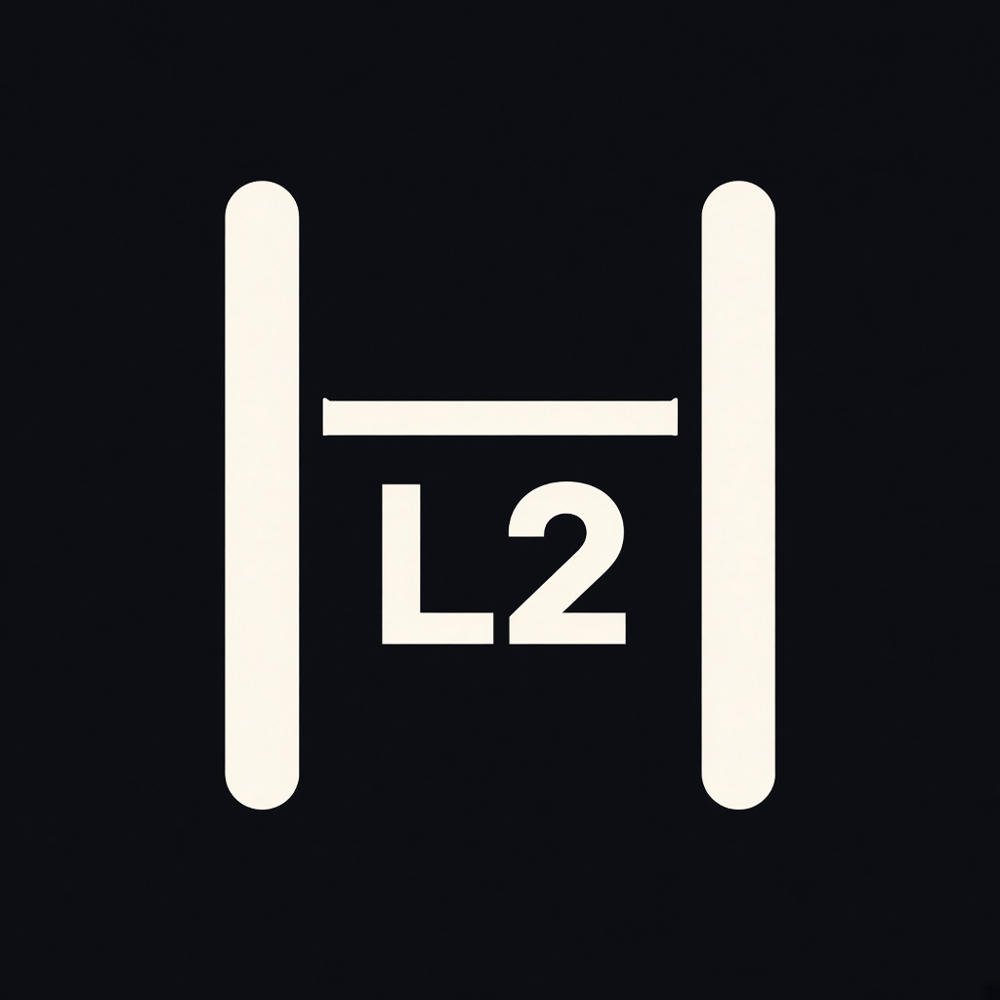

# L2AxisBr

<p align="center">
  
</p>

Two-port MAC-learning Ethernet bridge on AXI-Stream. A recorded pcap is replayed through DPI-C onto one or both ports; `pkt_l2br` learns, floods, forwards, or filters; a C model of the same table scores every decision.

What it does is switch Ethernet frames between two AXI-Stream ports: learn a source MAC, then flood, forward, or filter. The bench replays a pcap in Verilator. That is a two-port L2 switch in simulation.

Ethernet shows up beside GPUs when two machines exchange traffic (a NIC, RoCE, or InfiniBand, often with GPUDirect). A learning bridge can sit on that L2 path only after it is attached to real MACs. Even then it forwards frames.

[Pcap2HDL](https://github.com/khademullah/Pcap2HDL) is the pcap-to-AXIS fixture this bench follows (`tvalid && tready`, BPF in C, observers beside the wires). L2AxisBr is the device that hangs on two of those slave ports.

The worked capture is [`ns1_iperf.pcap`](ns1_iperf.pcap): iperf3 between two veth endpoints, Ethernet link type 1, opened by [`dpi/pcap_reader.c`](dpi/pcap_reader.c). Logs for the first 64 frames are in [`examples/`](examples/README.md).

## Quick start

Linux, Verilator 5.020 or later, and libpcap:

```bash
sudo apt update
sudo apt install build-essential verilator libpcap-dev
make demo
```

`make demo` replays the first 64 frames twice and checks the summaries below. GTKWave is optional (`make wave` after a run).

Both directions of the capture enter port A. The first frame floods; both MACs are then known on A, so the rest of the conversation is filtered:

```
[BR] rx_a=64  rx_b=0  tx_a=0  tx_b=1  flood=1  fwd=0  filter=63  drop=0  byte_mis=0  mis=0
```

`SPLIT=1` places source `02:00:00:00:00:01` on port A and every other source on port B. After the opening flood, unicast traffic is forwarded:

```
[BR] rx_a=38  rx_b=26  tx_a=26  tx_b=38  flood=1  fwd=63  filter=0  drop=0  byte_mis=0  mis=0
```

The same commands by hand:

```bash
make PCAP=ns1_iperf.pcap MAX_PACKETS=64 BP=2
make PCAP=ns1_iperf.pcap MAX_PACKETS=64 BP=2 SPLIT=1
make PCAP=ns1_iperf.pcap MAX_PACKETS=1000
make PCAP=ns1_iperf.pcap MAX_PACKETS=64 FILTER='tcp port 5201'
make AXIS_W=64 PCAP=ns1_iperf.pcap MAX_PACKETS=64 SPLIT=1
make PAUSE=1 PCAP=ns1_iperf.pcap MAX_PACKETS=64
```

`BP=2` randomizes `tready` on the ingress masks and on both egress masters. `PAUSE=1` toggles a bubble inside the slave. Counts stay the same: a beat is accepted only when `tvalid && tready`. The file holds 1000 frames; `MAX_PACKETS` is the cap.

## Scoreboard

`dpi/l2_model.c` and `pkt_l2br` share one table: 1024 entries, learn a unicast source, then look up the destination. The C model runs on the bytes the ingress observer accepted. `mis` is how often that result and the DUT decision differ, or how often the observer’s length or fingerprint disagrees with the pcap. `byte_mis` is how often an egress frame’s length or fingerprint disagrees with the ingress frame that was forwarded.

| Count | Meaning |
|---|---|
| `rx_a`, `rx_b` | Ingress frames, from the observer on the slave pins |
| `tx_a`, `tx_b` | Egress frames, from the observer on the master pins |
| `flood` | Destination unknown, broadcast, or I/G multicast; sent out the other port |
| `fwd` | Destination known on the other port |
| `filter` | Destination already known on the ingress port; nothing is sent |
| `drop` | Shorter than the mode minimum or longer than its maximum. The default is under 12 or over 2048. No learn, no egress |

On a two-port bridge, flood and forward use the same egress wires. The codes stay distinct so the summary can count them. Observers sit on the port pins, not on the buffer inside the bridge.

## Forwarding rules

For a frame of 12 to 2048 bytes:

1. Install a unicast source MAC on the ingress port. Multicast sources are not installed.
2. Broadcast and I/G multicast flood the other port.
3. A unicast hit on this port is filtered.
4. A unicast hit on the other port is forwarded.
5. A miss floods the other port.

Learning uses the outer addresses in the first 12 bytes, so a VLAN tag stays in the payload and does not move the MAC fields. The table takes the first free slot. When it is full, one entry is replaced and the victim index advances. `AGE=0` keeps an entry until that replacement. `AGE=N` expires it N clocks after the last learn or refresh, and the next unicast to that MAC floods. A same-port frame refreshes the stamp. STP, LAG, and QinQ are out of scope.

`s_tready` is low while that port’s buffer is committed to the other master, while `ready_mask` is low, or while `pause_en` inserts a bubble.

## Pins

Each ingress port is the [`nic_rx`](https://github.com/khademullah/Pcap2HDL) slave list. Each egress port is the matching AXI-Stream master. A frame taken on A is offered on B, and the other way around. The far side drives `m_tready`.

| `nic_rx` | Port A | Port B |
|---|---|---|
| `clk`, `rst_n` | `clk`, `rst_n` | same |
| `s_tdata`, `s_tkeep`, `s_tvalid`, `s_tready` | `a_s_*` | `b_s_*` |
| `s_tstart`, `s_tlast` | `a_s_*` | `b_s_*` |
| `s_tuser`, `s_tuser_err` | `a_s_*` | `b_s_*` |
| `ready_mask`, `pause_en` | `a_ready_mask`, `a_pause_en` | `b_ready_mask`, `b_pause_en` |

`a_dec_valid` / `b_dec_valid` pulse the cycle after the ingress `tlast` handshake. `a_dec_act` / `b_dec_act` are `0` filter, `1` forward, `2` flood, `3` drop. `a_dec_bytes` / `b_dec_bytes` are the accepted length.

## Data path

```
ns1_iperf.pcap
    -> libpcap (dpi/pcap_reader.c: open, BPF, caplen, fingerprint)
    -> tb_l2br AXI-Stream master
         |- pkt_l2_obs   slave wires, port A and port B
         |- pkt_l2br     learn / flood / forward / filter
         `- pkt_l2_obs   master wires, port A and port B
    dpi/l2_model.c scores the same MAC table
```

File format and BPF stay in C. The MAC table and the datapath are clocked SystemVerilog. Default width is 8 bits. `AXIS_W=64` packs eight bytes per beat.

## Layout

| Path | Role |
|---|---|
| `hdl/pkt_l2br.sv` | Bridge |
| `hdl/pkt_l2_obs.sv` | Observer on one AXI-Stream port |
| `hdl/tb_l2br.sv` | pcap master and scoreboard |
| `dpi/pcap_reader.c` | libpcap read, BPF, byte fingerprint |
| `dpi/l2_model.c` | C MAC table |
| `ns1_iperf.pcap` | iperf3 veth capture |
| `scripts/gen_pcap.py` | Seven-frame regression pcap used by `make ci` |
| `examples/` | Logs for the capture and for the regression |
| `docs/logo.jpg` | Logo, dark |
| `docs/logo-2.jpg` | Logo, light |
| `docs/already-on-the-wire.md` | Comparison with chips that already forward |
| `docs/milestones.md` | Ten items left for later |
| `docs/index.html` | Project page GitHub Pages serves from `docs/` |

## Regression

`make ci` builds a seven-frame pcap (TCP handshake, two data segments, ARP request, ARP reply) and checks port A, `SPLIT=1`, `AXIS_W=64`, and `PAUSE=1`. It then writes `drop.pcap`: a full frame, an 8-byte runt, and another full frame. The runt must be dropped without changing the MAC table, at both 8-bit and 64-bit width. It also writes `table.pcap`: 17 broadcasts that learn distinct sources, then one frame back to the first source, which must still filter. That gate does not depend on the iperf file. Expected lines:

```
[BR] rx_a=7  rx_b=0  tx_a=0  tx_b=2  flood=2  fwd=0  filter=5  drop=0  byte_mis=0  mis=0
[BR] rx_a=4  rx_b=3  tx_a=3  tx_b=4  flood=2  fwd=5  filter=0  drop=0  byte_mis=0  mis=0
[BR] rx_a=3  rx_b=0  tx_a=0  tx_b=1  flood=1  fwd=0  filter=1  drop=1  byte_mis=0  mis=0
[BR] rx_a=18  rx_b=0  tx_a=0  tx_b=17  flood=17  fwd=0  filter=1  drop=0  byte_mis=0  mis=0
[BR] rx_a=3  rx_b=0  tx_a=0  tx_b=2  flood=2  fwd=0  filter=1  drop=0  byte_mis=0  mis=0
[BR] rx_a=2  rx_b=1  tx_a=1  tx_b=2  flood=2  fwd=1  filter=0  drop=0  byte_mis=0  mis=0
```

`AGE=1000` with `TS_GAP=1` is the aging line. The pcap learns a MAC, filters the next frame while the entry is still young, then idles 2000 clocks. The same destination floods once the entry has expired. `AGE=0` on that file filters the third frame instead.

`PORT_TS=1` is the move line. The pcap seconds field is the ingress port. Host `02:00:00:00:00:01` is learned on A, seen next on B, and the third frame is forwarded to B.

A change to learn, flood, or filter belongs in both `hdl/pkt_l2br.sv` and `dpi/l2_model.c`. `CAM_N` is 1024. The default legal length is 12 to 2048 bytes. The buffer holds 9000, which `LEN=2` uses.

How this simulation compares with a KSZ8863, a top-of-rack switch, a ConnectX eSwitch, and an open MAC is in [docs/already-on-the-wire.md](docs/already-on-the-wire.md).

## Later

Each one is added in both `hdl/pkt_l2br.sv` and `dpi/l2_model.c`. `make ci` still ends at `mis=0` and `byte_mis=0`. STP, LAG, and QinQ stay out. The same list is in [docs/milestones.md](docs/milestones.md).

1. **Aging.** Supported. `AGE=N` expires an entry N clocks after it was learned or refreshed. `AGE=0` is the default. The next unicast to an expired MAC floods.
2. **Station move in the regression.** Supported. A source learned on A and then seen on B is updated. Traffic to that MAC leaves on B. `PORT_TS=1` picks the port, and `make ci` checks the forward.
3. **Both ports in one cycle.** Supported. `BOTH=1` offers a beat on A and B together. The twins still apply A, then B.
4. **More than one frame in the ingress buffer.** Supported. The next frame is accepted while the previous one is still leaving. `make ci` checks that those cycles overlap.
5. **Ethernet lengths.** Supported. `LEN=0` is 12 to 2048. `LEN=1` is 64 to 1518. `LEN=2` is 64 to 9000.
6. **One VLAN.** Supported. A source is learned with its 802.1Q VID. Untagged frames stay on VID 0. Flood and filter stay inside that VID.
7. **Slot compare.** Supported. After the pcap, every valid bit, MAC, VID, and port is checked against the C table. A mismatch adds to `mis`.
8. **The whole capture.** Supported. `make ci` replays all 1000 frames of `ns1_iperf.pcap`, once into port A and once with `SPLIT=1`.
9. **Other widths.** Supported. The same split pcap passes at `AXIS_W` 32, 128, and 256, along with 8 and 64.
10. **A static multicast table.** Supported. `MCAST=1` installs `01:00:5e:00:00:01` on port B. That group is forwarded from A and filtered on B. An unknown group still floods.

## License

MIT. See `LICENSE`.
